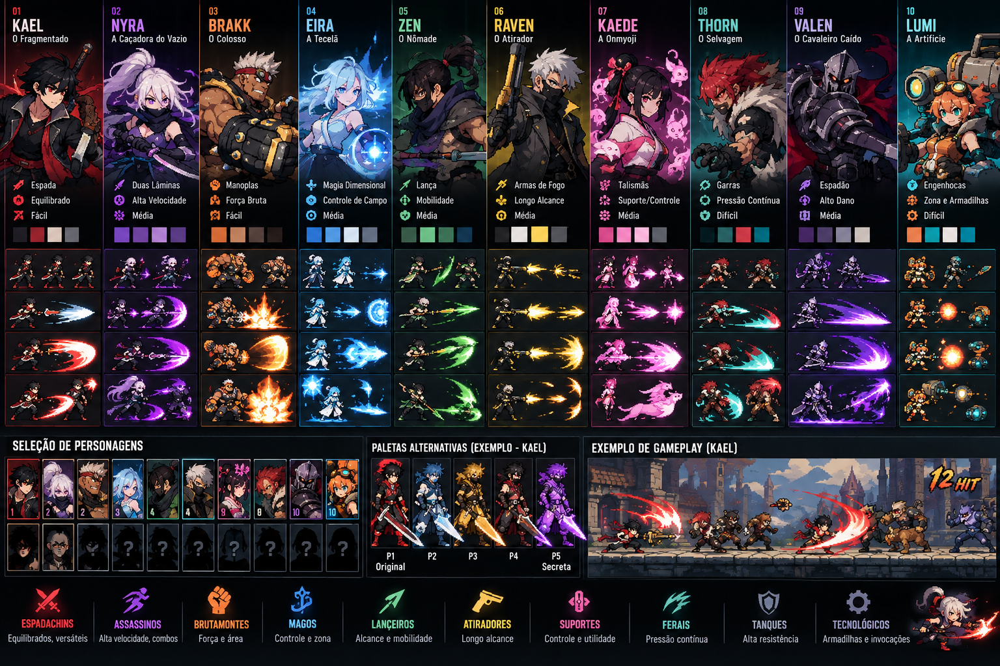

# RIFTBOUND // Arena

Protótipo de jogo de luta 2D inspirado na filosofia de produção de personagens do MUGEN: lutadores simples de produzir, fáceis de expandir e compartilhando uma engine comum.



## O que já existe

- 10 personagens jogáveis: Kael, Nyra, Brakk, Eira, Zen, Raven, Kaede, Thorn, Valen e Lumi.
- Arcade contra CPU.
- Versus local para 2 jogadores no mesmo teclado.
- Modo treino.
- Seleção de personagem 5x2.
- Vida, barra de energia, timer, rounds e melhor de 3.
- Ataques leves, pesados, especiais e ultimates.
- Defesa, blockstun, hitstun, knockback, armor e invulnerabilidade.
- Combos e contador de hits.
- IA básica que anda, recua, bloqueia e usa golpes.
- Projéteis, partículas, afterimages, hit-stop, screen shake e flash de impacto.
- 3 cenários sorteados com parallax simples.
- Áudio sintetizado via Web Audio API, sem arquivos externos.
- Controles touch básicos para teste em celular.
- Zero bibliotecas e zero processo de build: GitHub Pages abre direto.

## Controles

### Menus
- Setas ou WASD: navegar.
- Enter / Espaço: confirmar.
- Esc: voltar ou pausar.

### Jogador 1
- A / D: mover.
- W: pular.
- S: defender.
- J: ataque leve.
- K: ataque pesado.
- L: especial.
- I: ultimate quando a barra estiver cheia.

### Jogador 2
- ← / →: mover.
- ↑: pular.
- ↓: defender.
- Numpad 1 / N: ataque leve.
- Numpad 2 / M: ataque pesado.
- Numpad 3 / ,: especial.
- Numpad 0 / .: ultimate.

## Rodar localmente

Você pode simplesmente abrir `index.html` no Chrome. Para evitar limitações de navegador, também pode usar qualquer servidor estático local.

## Publicar no GitHub Pages

1. Crie um repositório no GitHub.
2. Envie todos os arquivos deste projeto para a raiz do repositório.
3. No repositório, entre em `Settings` → `Pages`.
4. Em `Build and deployment`, escolha `Deploy from a branch`.
5. Selecione a branch `main` e a pasta `/ (root)`.
6. Salve. O GitHub mostrará o endereço público assim que publicar.

Não há `npm install`, chave de API, backend ou banco de dados.

## Como criar personagens em massa

O arquivo mais importante para isso é `characters.js`. Cada lutador é um objeto de configuração. A engine lê os dados e reaproveita movimentação, física, HUD, colisão e efeitos.

Exemplo simplificado:

```js
{
  id: 'novo',
  name: 'NOVO',
  title: 'O Subtítulo',
  role: 'Espadachim',
  weapon: 'sword',
  color: '#d92f43',
  accent: '#ff8295',
  dark: '#171a23',
  hp: 1000,
  speed: 5.7,
  jump: 15.2,
  power: 1.0,
  defense: 1.0,
  reach: 1.05,
  difficulty: 'Fácil',
  special: 'Nome do Especial',
  ultimate: 'Nome da Ultimate',
  specialType: 'wave',
  lore: 'Descrição curta.'
}
```

### Tipos de arma atualmente desenhados pela engine

`sword`, `dual`, `gauntlet`, `focus`, `spear`, `gun`, `talisman`, `claw`, `greatsword`, `cannon`.

### Tipos de especial atualmente programados

- `wave`: onda de energia.
- `blink`: teleporte / dash ofensivo.
- `slam`: impacto de área.
- `orb`: projétil mágico grande.
- `lunge`: investida longa.
- `gun`: rajada de tiros.
- `seal`: talismã/projétil de controle.
- `maul`: sequência agressiva curta.
- `armor`: golpe lento com armadura.
- `drone`: dispositivo tecnológico.

Isso permite criar uma grande quantidade de protótipos apenas combinando estatísticas, arma, cores e comportamento. Depois, personagens realmente importantes podem ganhar lógica exclusiva.

## Estrutura

```text
riftbound-mugen/
├── index.html
├── styles.css
├── characters.js     # elenco e balanceamento
├── game.js           # engine e gameplay
├── .nojekyll
├── README.md
└── assets/
    ├── favicon.svg
    └── concept-roster.png
```

## Próxima evolução recomendada

A engine atual usa bonecos procedurais para não depender de sprites externos. O passo visual seguinte é substituir `drawFighterSprite()` por spritesheets reais mantendo a mesma lógica de combate. Assim podemos produzir os desenhos separadamente sem quebrar gameplay, IA ou balanceamento.

Uma estrutura futura por personagem pode ser:

```text
assets/fighters/kael/
├── idle.png
├── walk.png
├── jump.png
├── light.png
├── heavy.png
├── special.png
├── ultimate.png
├── hurt.png
└── portrait.png
```

O ideal é todos usarem o mesmo tamanho de frame, origem e convenção de nomes.

## Estado do projeto

Esta é uma **vertical slice jogável**, não uma versão final. A base técnica já permite iterar no combate e multiplicar o elenco; animações desenhadas à mão, online multiplayer, campanha, save e editor visual ainda não foram implementados.
